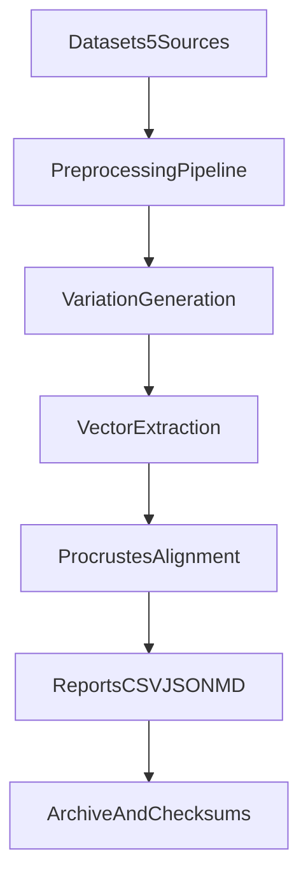

# IMD-V2 (IsomorphicDataSet V2)

Research-oriented framework for testing latent-space isomorphism across LLMs using multi-dataset pipelines, vector extraction, Procrustes alignment, and reproducible experiment reporting.

## What This Repo Contains

- `isomorphic/` core package (config, datasets, extractors, alignment, pipeline)
- `experiments/` experiment runners (`exp_001` to `exp_008`) and generated outputs
- `config/` model, dataset, and experiment configuration files
- `scripts/` setup, run, stats, and reproducibility helpers
- `tests/` unit, integration, performance, and statistics tests
- `planning/` source planning documents used to define implementation scope

## Quick Start

```bash
python -m venv .venv
.venv\Scripts\activate
python -m pip install -e .
python -m pip install pytest
python -m pytest -q
```

## Install

```bash
python -m venv .venv
.venv\Scripts\activate
python -m pip install --upgrade pip
python -m pip install -e .
```

Optional dev extras:

```bash
python -m pip install pytest scipy pandas scikit-learn pyyaml
```

## Run Pipeline and Experiments

```bash
python scripts/setup_datasets.py
python scripts/run_experiments.py
python scripts/compute_statistics.py
python scripts/generate_figures.py
```

## Reproducibility and Archival

- Fixed-seed workflow is documented in `docs/REPRODUCIBILITY.md`
- Full regeneration script: `scripts/regenerate_all_results.py`
- Results archival script: `scripts/archive_results.py`

## Architecture Diagram



## API Usage

Load dataset and preprocess:

```python
from isomorphic.loader import DatasetLoader

ds = DatasetLoader.load("toxigen", {"name": "toxigen", "limit": 100})
processed = ds.preprocess()
print(len(processed))
```

Run alignment pipeline:

```python
from isomorphic.pipeline import IsomorphicPipeline

pipe = IsomorphicPipeline("huihui-ai/Qwen2.5-7B-Instruct-abliterated-v2")
src = ["source sentence one", "source sentence two"]
tgt = ["target sentence one", "target sentence two"]
result = pipe.run_alignment(src, tgt, "exp_demo")
print(result["alignment"]["frobenius_error"])
```

## Citation

If you use this repository, cite using `CITATION.cff`.

BibTeX starter:

```bibtex
@software{imd_v2_2026,
  title = {IMD-V2 (IsomorphicDataSet V2)},
  author = {IMD-V2 Contributors},
  year = {2026},
  url = {https://github.com/MeiisamMahmoodii/IMD-V2}
}
```

## Repository URL

- GitHub: https://github.com/MeiisamMahmoodii/IMD-V2
